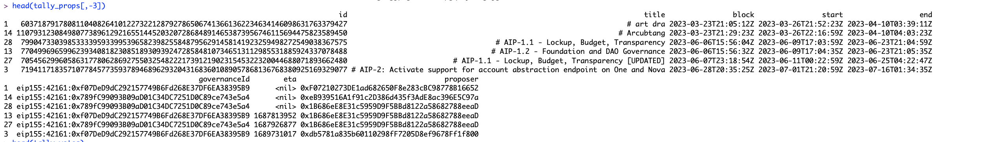
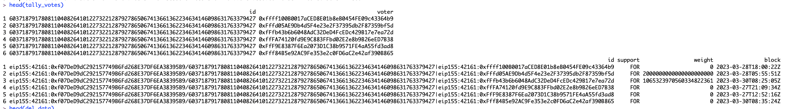
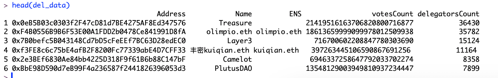

# ArbTallyData
To construct a sophisticated automated pipeline designed for seamless extraction of Arbitrum Governance Proposals, Votes, and the comprehensive list of delegates directly from Tally, this endeavor entails a series of meticulously orchestrated steps. Initially, the process demands the establishment of a reliable synchronization with Tally's API or relevant data endpoints, aimed at harvesting the freshest insights on governance proposals, vote tallies, and delegate rosters within the Arbitrum network. Following data acquisition, a crucial phase of data refinement and transformation is embarked upon. This phase is pivotal for purifying, structuring, and standardizing the initially raw datasets to a state of high utility and interpretability.

### Walkthrough

#### 1. Scrape all the Tally Proposals and Votes data and parse it into respective Dataframes.

- `Rscript scrapeProposalsVotes.R`

It uses `helperfuncs.R` under the hood which have the functions required to talk with GraphQL endpoint and fetch the required data.

Proposal Data from Tally

&nbsp;
&nbsp;

Votes Data from Tally

&nbsp;
&nbsp;

#### 2. Scrape all the Tally Delegates data and parse it into respective Dataframe.

- `Rscript scrapeDelegates.R`

It uses `helperfuncs.R` under the hood which have the functions required to talk with GraphQL endpoint and fetch the required data.

Delegate Data from Tally

&nbsp;
&nbsp;
